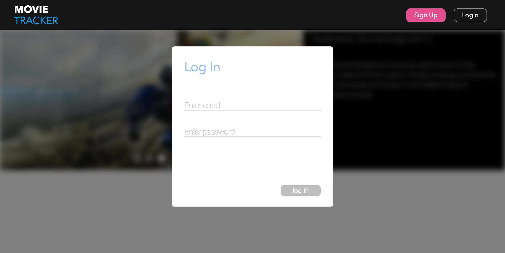
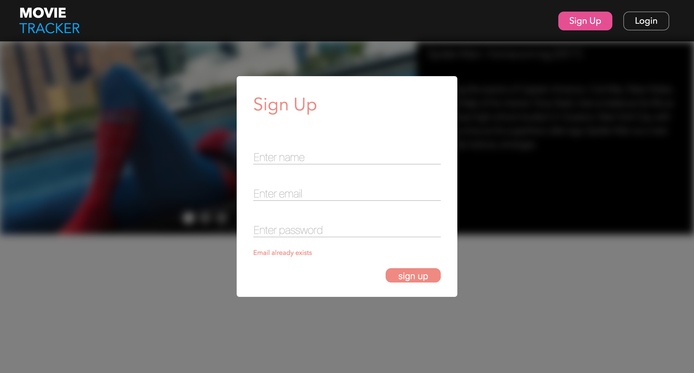
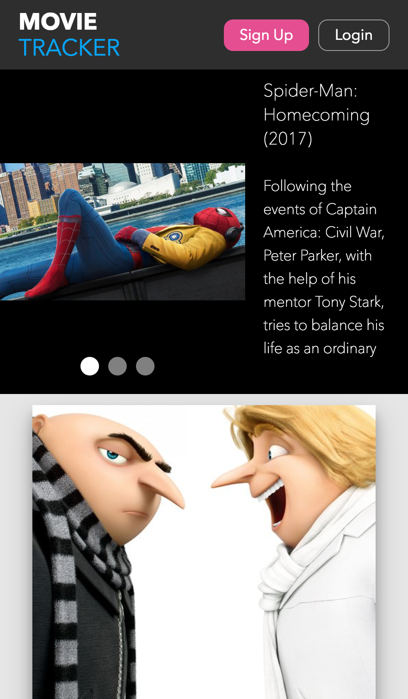

# Movie Tracker

Web app that displays movies that are now playing in theaters. It uses 'the movie db' API for movie data. Users are able to sign up and save favorites. If a movie card is clicked, then a new view is shown with more information about the movie.

## Screenshots

### Normal

## Log In

## Sign Up

### Mobile

